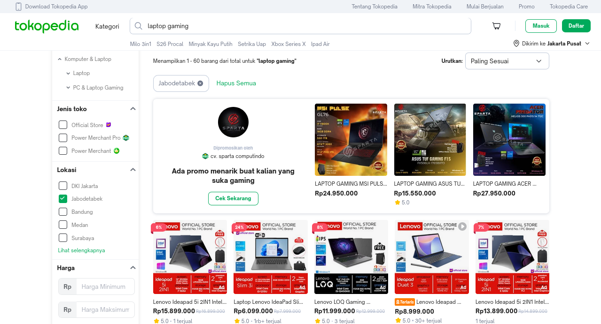

# Tokopedia Laptop Gaming Scraper @Dibimbing.id

## Deskripsi

Script ini dirancang untuk mengumpulkan data tentang laptop gaming dari Tokopedia menggunakan permintaan GraphQL. Data yang dikumpulkan mencakup informasi seperti nama produk, harga, rating, jumlah ulasan, lokasi toko, dan status resmi toko. Data kemudian disimpan dalam file CSV untuk analisis lebih lanjut.

## Link Tokopedia

https://www.tokopedia.com/search?fcity=144%2C146%2C150%2C151%2C167%2C168%2C171%2C174%2C175%2C176%2C177%2C178%2C179%2C463&navsource=&search_id=20240729055520182264294B240D197BRI&srp_component_id=04.06.00.00&srp_page_id=&srp_page_title=&st=&q=laptop%20gaming

## Fitur

- Mengambil data produk dari Tokopedia menggunakan GraphQL API.
- Memproses dan membersihkan data untuk analisis lebih lanjut.
- Menyimpan data dalam format CSV.
- Visualisasi data menggunakan berbagai pustaka Python.

## Persyaratan

- Python
- Requests
- Pandas
- Matplotlib
- Seaborn
- Plotly

## Instalasi

Instal pustaka yang diperlukan menggunakan pip:

pip install requests 
pip install pandas 
pip install matplotlib 
pip install seaborn 
pip install plotly

1. Menjalankan Script

Jalankan script scraper.py untuk mengambil data:

python Scraping.py

Data yang dikumpulkan akan disimpan di ./Data/Tokopedia_Laptop_Gaming.csv.

2. Visualisasi Data

- Matplotlib dan Seaborn digunakan untuk visualisasi data statis seperti histogram dan scatter plot.
- Plotly Express dan Plotly Graph Objects digunakan untuk visualisasi interaktif seperti box plot dan bar chart.
